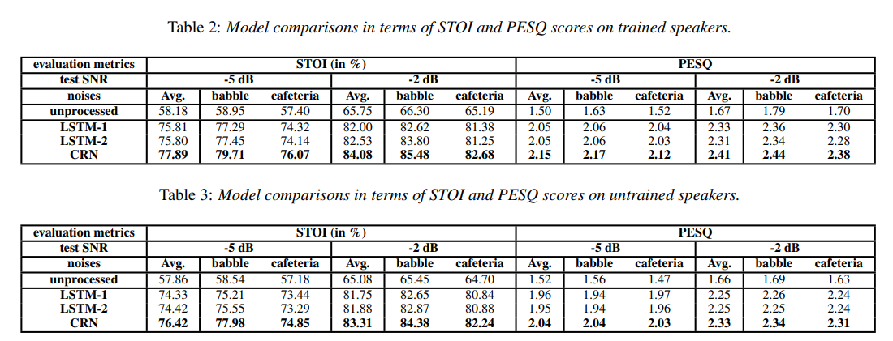

# A Convolutional Recurrent Neural Network for Real-Time Speech Enhancement

論文連結：https://web.cse.ohio-state.edu/~tan.650/doc/papers/Tan-Wang1.interspeech18.pdf

# 需要了解問題
* time-frequency (T-F) masking
* mask estimation

兩個好像有相關，需要了解遺下 T-F mask 是甚麼，名詞出現在 introduction 中。
* GRU 為甚麼沒有辦法做 real-time
* LSTM 還沒看特定

## 簡介
這篇論文提出了 real-time 的單聲道的語音增強技術。模型是基於 convolutional recurrent network (CRN) 做出改改良的模型。從名字可以明顯看出有包含了兩個最常見的模型架構 CNN 與 RNN。

此篇 paper 的 CRN 包含了兩個主要現今已存在的架構，convolutional encoder-decoder (CED) 和 long short-term memory (LSTM)，這樣的架構讓他能夠自然地達成 real-time 的基本條件，應該是因為不需要用到未來資料的意思。

在這篇 paper 作者的實驗中，CRN 的效果比一般 LSTM based 的模型效果都來的優異。

## 介紹
Speech separation 目的是將目標聲音與干擾的聲音分離，干擾聲音包含：
* 非人造噪音
* 目標聲音在房間內聲音的回音
* 甚至是其他人的聲音

這種技術在現實世界中應用非常的廣泛，像是增強 speech recognition 和 遠端通話。而大部分的應用都需要做到 real-time。**在助聽器上 3 毫秒的延遲就會讓被注意到，如果延遲超過 10 毫秒則會讓人產生反感**

>註：我認為這邊寫錯了，應該是 30 毫秒才會聽出延遲，超過 100 毫秒會讓人反感，參考資了：https://www.cgds.com.tw/2015-winter-move/index3.html

>註：人的一般發聲平率在 100～220 Hz，唱歌時則可以到達 50～1500 Hz，經過專業訓練的的聲樂家可以超過 2000 Hz。

在 supervised speech enhancement 中，最重要的兩個問題就是
* 噪音泛化
* 人聲泛化

>註：泛化原文 generalization，也就是指廣泛使用化。

為了解決這類問題，最簡單的作法就是直接將很多噪音與很多人聲都到機器裡做訓練，而這種方法在一般 feedforward DNN 並沒有辦法做到人聲泛化的結果。有一種解釋是說，因為一般的模型架構是 frame by frame 的作預測，這樣並沒有辦法有效的使用到長時間的音訊。因此許多研究都建議使用 sequence-to-sequence 的 model，使模型能夠有效的使用到整段音訊的資料。

先前有人提出使用 四層的 LSTM layer 作為人聲泛化的解法，確實成果也有顯著的提升。相對於這個人的研究成果，在	2018 年的時候有人基於 dilated convolutions 上使用 GRU 做為 Layer。這兩個成果相比之下，GRU 使用參數更為有效率，且在人聲泛化的表現上也比較好，相反的，GRU需要更多的特徵資料做 mask estimation 、spectral mapping at each time frame，因此沒有辦法實現 real-time 的語音增強。

受到	CRN 的啟發，這篇 paper 的作者提出了新的 CRN 架構。架構包含了 CED 和 LSTM
 
 ## 系統介紹
 
 ### CED
* Encoder：五層 convolution layers
* Decoder：五層 deconvolutional layer
* Activation function：都是 ELUs，除了 output layer 沒有使用。
	* ELUs(exponential linear units)被視為比 ReLU 泛化性更高，收斂更快的單元
* Output layer：使用 softplus activation，就是 ReLU 的平滑版
	* 公式：$f(x)=ln(1+exp(x))$
	* 這樣做可以保證輸出是正的
* 會在每一層 convolution layer 之後與 activatoin 之前做 batch normalization。
* Encoder 與 Decoder 的 kernel 是對成的，Encoder 的上升，Decoder 的就下降。
* Convolution 的 stride 都是 2：為了更有效的利用上下文。
* 為了增加資訊的流動，會將 Encoder 與 Decoder 的資訊跳著接起來。

### LSTM

他們將兩層 LSTM 放在	Encoder 與 Decoder 之間，為了讓 Input 符合 LSTM，Encoder 出來的資料會經過 flatten 才放入 LSTM，LSTM 出來的資料也會 reshape 後才放入 Decoder，值得注意的是即使是這樣經過 reshape 後，依舊不影響 LSTM 的表現。

### Network architecture

input 

**總架構：**

**CNN：**

圖表中的資訊格式如下：
* input & output size：(featureMaps × timeSteps × frequencyChannels)
* hyperparameters：(kernelSize,strides, outChannels)
	* 其中的 kernelSize 是 (time × frequency)

**LSTM：**

## 實驗
### 實驗設置
使用以下資料庫作為聲音來源：
* 包含 7138 聲音，83個說話者(42男、41女)，將其中 6 個說話者當作 testing set(3男、3女)。
* 來源：http://spandh.dcs.shef.ac.uk/chime_challenge/chime2013/chime2_task2.html

使用以下資料庫做為噪音：
* https://www.sound-ideas.com/ (好像要錢，裡面都是聲音特效)
* https://auditec.com/ (作為 testing 的噪音)

**訓練資訊**
Optimizer：Adam (0.00002 learning rate)
Loss funciton：MSE
batch：16
padding：將所有的音訊都補零到與最長音訊一樣

## 實驗結果
使用 STOI 和 perceptual evaluation of speech quality (PESQ) 衡量結果。

